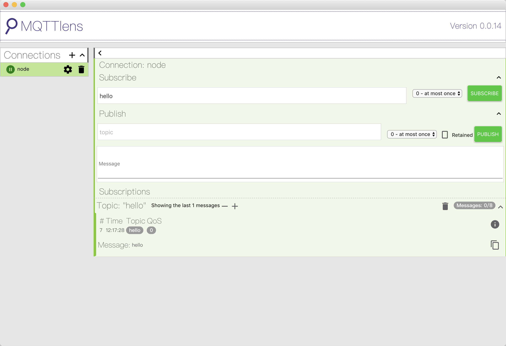

## emq发送消息

### 前言

本文演示通过java代码发送 mqtt消息到emq服务器上，通过mqttlens获取该消息；


### 代码

* pom.xml依赖   
```xml
        <dependency>
            <groupId>org.springframework.boot</groupId>
            <artifactId>spring-boot-starter-web</artifactId>
        </dependency>
        <dependency>
            <groupId>org.springframework.boot</groupId>
            <artifactId>spring-boot-starter-integration</artifactId>
        </dependency>
        <dependency>
            <groupId>org.springframework.integration</groupId>
            <artifactId>spring-integration-stream</artifactId>
        </dependency>
        <dependency>
            <groupId>org.springframework.integration</groupId>
            <artifactId>spring-integration-mqtt</artifactId>
        </dependency>

        <dependency>
            <groupId>org.springframework.boot</groupId>
            <artifactId>spring-boot-devtools</artifactId>
            <scope>runtime</scope>
        </dependency>
        <dependency>
            <groupId>org.projectlombok</groupId>
            <artifactId>lombok</artifactId>
            <optional>true</optional>
        </dependency>

```

* emq配置application.yaml 

```yaml
#mq配置
spring:
  mqtt:
    username: admin
    password: public
    host-url: tcp://192.168.3.100:1883
    client-id: mqttId
    default-topic: topic
```

* emq配置获取   
```java
package com.nick.mqttdemo1.config;
@Getter
@Setter
@ConfigurationProperties("spring.mqtt")
@Component
public class MqttProperties {

    private String username;

    private String password;

    private String hostUrl;

    private String clientId;

    private String defaultTopic;

}
```

* 配置注入

```java
package com.nick.mqttdemo1.config;

@Configuration
public class MqttConfiguration {

    @Autowired
    private MqttProperties mqttProperties;

    @Bean
    public MqttConnectOptions getMqttConnectOptions(){
        MqttConnectOptions mqttConnectOptions=new MqttConnectOptions();
        mqttConnectOptions.setUserName(mqttProperties.getUsername());
        mqttConnectOptions.setPassword(mqttProperties.getPassword().toCharArray());
        mqttConnectOptions.setServerURIs(new String[]{mqttProperties.getHostUrl()});
        mqttConnectOptions.setKeepAliveInterval(2);
        return mqttConnectOptions;
    }
    @Bean
    public MqttPahoClientFactory mqttClientFactory() {
        DefaultMqttPahoClientFactory factory = new DefaultMqttPahoClientFactory();
        factory.setConnectionOptions(getMqttConnectOptions());
        return factory;
    }
    @Bean
    @ServiceActivator(inputChannel = "mqttOutboundChannel")
    public MessageHandler mqttOutbound() {
        MqttPahoMessageHandler messageHandler =  new MqttPahoMessageHandler(mqttProperties.getClientId(), mqttClientFactory());
        messageHandler.setAsync(true);
        messageHandler.setDefaultTopic(mqttProperties.getDefaultTopic());
        return messageHandler;
    }
    @Bean
    public MessageChannel mqttOutboundChannel() {
        return new DirectChannel();
    }

}
```


* 发送mqtt消息服务   
```java
package com.nick.mqttdemo1.server;

import org.springframework.integration.annotation.MessagingGateway;
import org.springframework.integration.mqtt.support.MqttHeaders;
import org.springframework.messaging.handler.annotation.Header;

@MessagingGateway(defaultRequestChannel = "mqttOutboundChannel")
public interface MqttTestServer {
    void sendToMqtt(String data, @Header(MqttHeaders.TOPIC)String topic);
}
```

* 测试控制类  
```java
package com.nick.mqttdemo1.controler;

@Slf4j
@RestController
@RequestMapping("/test")
public class TestController {

    @Autowired
    private MqttTestServer mqttTestServer;

    @GetMapping("/sendMq")
    public  String sendMqtt(String sendData){
        mqttTestServer.sendToMqtt(sendData, "hello");
        log.info("send success");
        return "send success";
    }
}
```


### 测试

* 启动emq；

* 启动发送程序；

* mqttlens(chrome 访问地址``chrome://apps/``),选择mqttlens启动该程序，按emq服务器的参数新建配置一个emq连接;

* 使用postman 或者是浏览器发送get 请求 ``http://localhost:8080/test/sendMq?sendData=hello``

* 确定mqttlens是否收到数据，如下图:  



* 在emq dashboard界面上，能看到java程序，和mqttlens各自建立了一个链接；