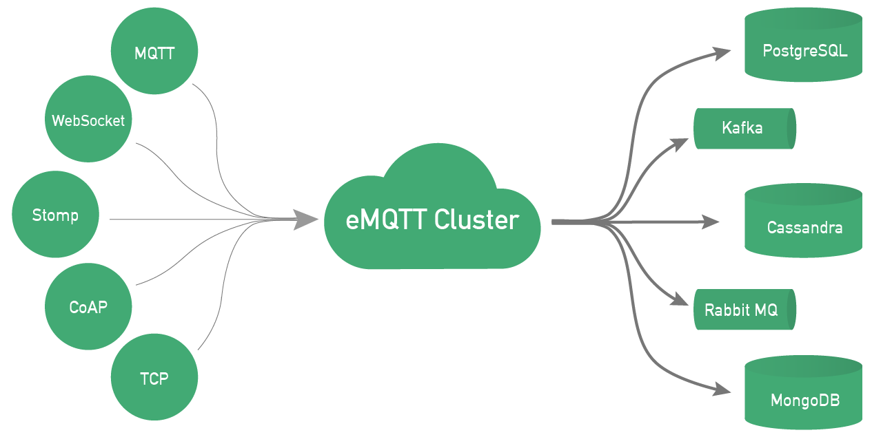

## emq是什么

百万级分布式开源物联网MQTT消息服务器

### 简介

基于高并发的Erlang/OTP语言平台设计，支持百万级连接和分布式集群，发布订阅模式的开源MQTT消息服务器

完整支持MQTT V3.1/V3.1.1协议规范，扩展支持WebSocket、Stomp、CoAP、MQTT-SN或私有TCP协议

### 特点

* 完全开放源码,基于Apache Version 2.0开源协议
* 百万级并发连接,单节点100万并发MQTT连接峰值负载
* 完整MQTT协议支持,MQTT V3.1.1协议规范QoS0/1/2消息支持
* 简便安装部署,跨平台部署在Linux、FreeBSD、Mac OS X或Windows服务器
* 分布式集群或桥接,双节点负载均衡或多节点分布式集群
* 扩展模块与插件,LDAP, MySQL, PostgreSQL, Redis, MongoDB扩展插件集成

### 更多内容

更多内容请查看[emq官网](http://www.emqtt.com/)